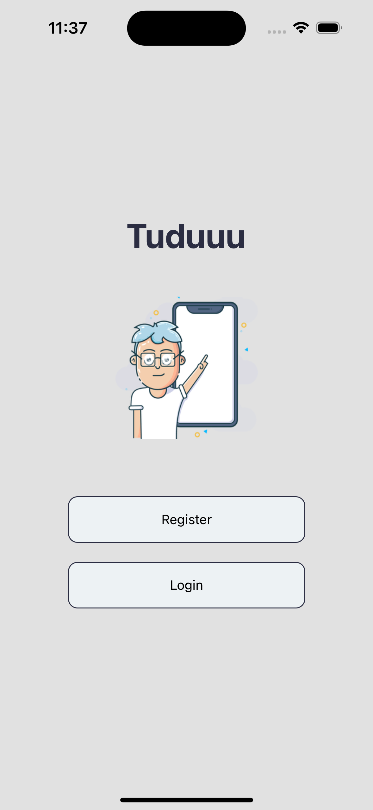
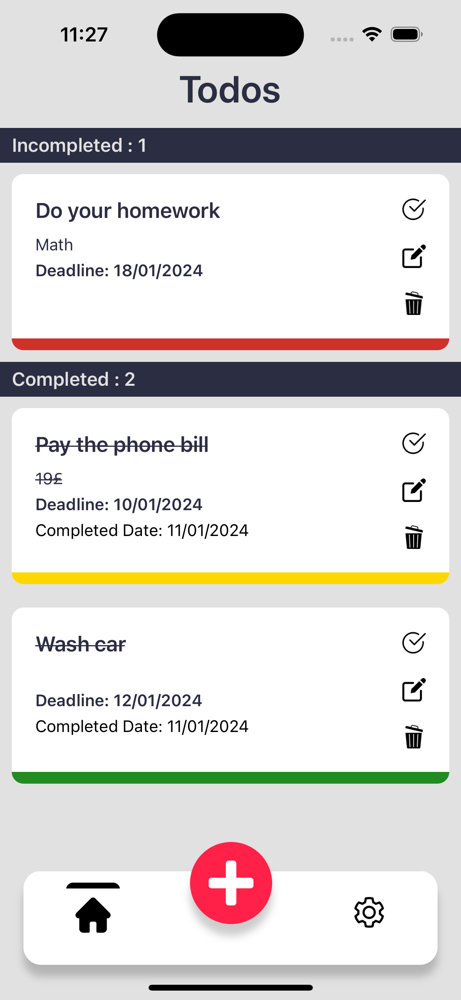
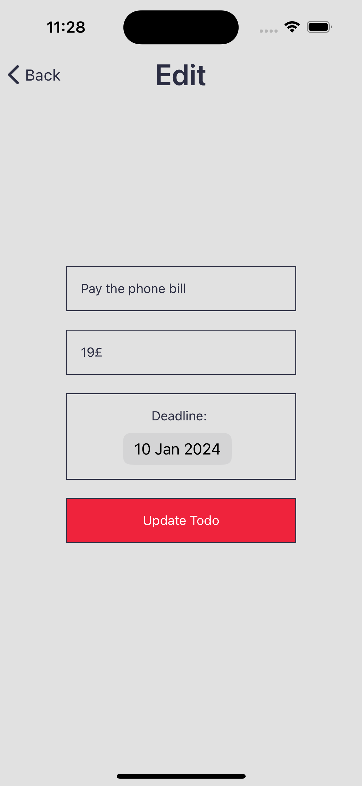
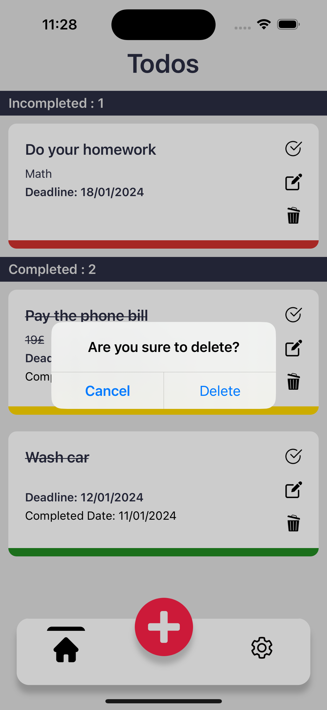

# Tuduu

## Description

The Todo App is a simple task management application that allows users to create, update, and delete tasks. It provides a straightforward interface for users to organize their daily tasks and keep track of their progress.

## Features

- **Add Task:** Easily add new tasks to the list.
- **Mark as Completed:** Mark tasks as completed to keep track of your progress.
- **Edit Task:** Update task details or make changes as needed.
- **Delete Task:** Remove tasks that are no longer relevant or completed.
- **Colored Feedback for completed tasks to achieve better user experience**

## Technologies Used
- **Language:** [JavaScript](https://ecma-international.org/publications-and-standards/standards/ecma-262/)
- **Framework:** [React Native](https://reactnative.dev/)
- **Backend Services:** [Firebase](https://firebase.google.com/)
- **Form Validation:** [Yup](https://github.com/jquense/yup)
- **Form Management:** [Formik](https://formik.org/)
- **Navigation:** [React Navigation](https://reactnavigation.org/)

## Screenshots

